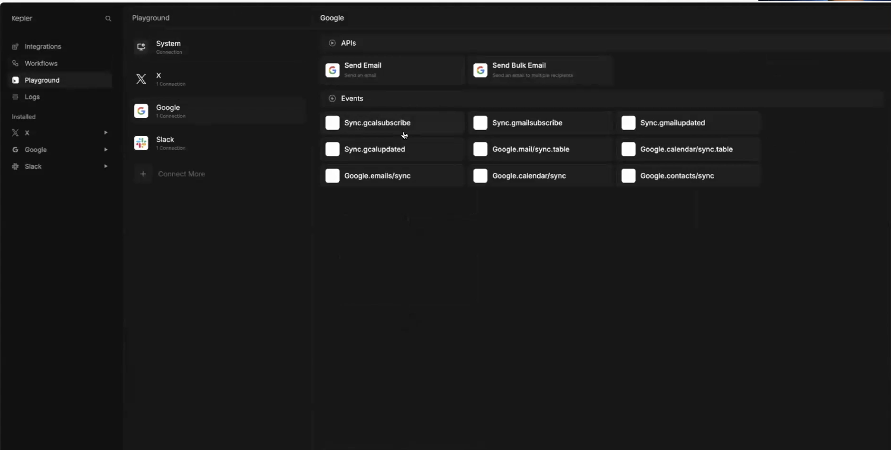

## Knowledge Sources

There are three approaches to providing application-specific knowledge to your AI application:

- stuff it directly into the **context window** (simple but often inefficient), 
- set up **tool calls** that let the model query your systems on demand (great for real-time data).
- implement **retrieval-augmented generation** (RAG) by creating a searchable vector index of your documents (essentially a semantic search engine that feeds relevant chunks to the model)

Mastra supports all three approaches. It syncs data from your systems into a Postgres database, and then you can feged it directly into your agents or workflows, or vectorize it for RAG.

{/* TODO: update image */}
{/*  */}

## Knowledge Sync

With Mastra, you can sync data from SaaS services, web pages, documents, and more into your Postgres database to make your knowledge base.

### From SaaS services

Installed integrations expose a set of sync events. For local development, or if you want to give your users a way to trigger syncs, Mastra provides a [`triggerEvent` function](https://github.com/mastra-ai/mastra/blob/c558bb6564ae9b8ae176bdcb9e63f4a7121a9bbb/examples/agent-chatbot/lib/mastra/system-apis.ts#L125).

The data you sync will end up in your [Postgres database.](../reference/db-storage.md)

### From Scrapers

TKTK

## Providing Data to LLMs 

### Pushing Synced Data into Agent Context Windows

A logical first step is to push synced data into agent context windows. This is a simple way to get application-specific knowledge into your agents. You can use the [data layer API](../reference/data-layer.md) to query the Postgres database and feed the results into your agents.

TKTK example

### Querying Synced Data with Tool Calls

For complex computation or guaranteed consistency for key operations, you can use tool calls to query your synced data. You provide these as System APIs in your `mastra.config.ts` file. ([Example.](https://github.com/mastra-ai/mastra/blob/c558bb6564ae9b8ae176bdcb9e63f4a7121a9bbb/examples/twitter-client/src/lib/actions.ts#L8))

TKTK example

### Vectorizing Data for RAG

To improve accuracy as your knowledge base grows beyond the context window, you can vectorize your synced data and use it for retrieval-augmented generation (RAG). This requires a Pinecone account with API keys.

You can create a new vector index by filling out the form in your admin UI at [localhost:3456/rag/create](http://localhost:3456/rag/create). This will create a new vector config file in `./mastra/vector-configs`.

Full reference: [Vector DB Config](../reference/vector-db-config.mdx)