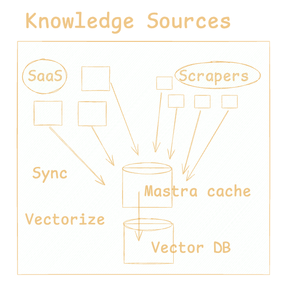

## Building Knowledge Sources

In order to provide knowledge sources to your AI application, you will need to sync your data from the systems where it lives (SaaS systems, web pages, documents, etc.) and then get that data into a format that can be queried by your agents.

Mastra provides configurable sync infrastructure that integrates with a range of data sources. You can sync data into a vector database for retrieval-augmented generation (RAG), feed into tool calls, or provide it in agent context windows.

## Configuring and Triggering Syncs

Every integration exposes a set of sync events. Sync events are specified in the format `<integration>.<entity>/<event-type>`, for example `asana.TasksForProject/sync`.

You can trigger these events using the `triggerEvent` function. ([Example.](https://github.com/mastra-ai/mastra/blob/c558bb6564ae9b8ae176bdcb9e63f4a7121a9bbb/examples/agent-chatbot/lib/mastra/system-apis.ts#L125)) 

After installing a data source integration, you can configure a sync in the Mastra admin console, or by editing the `mastra.config.ts` file.

You can trigger a sync manually in the admin console. We are adding a `syncInterval` option to the Mastra config, which will allow you to schedule regular syncs.

The data you sync will end up in your [Postgres database.](../reference/db-storage.md)

## Querying Synced Data Directly

After syncing, you can query the data from tool call functions or feed it into agent context windows using Mastra's query API. Mastra wraps the Prisma ORM, so the query API is the same as the Prisma Client API.

([Example.](https://github.com/mastra-ai/mastra/blob/c558bb6564ae9b8ae176bdcb9e63f4a7121a9bbb/examples/twitter-client/src/lib/actions.ts#L8))

## Vectorizing Data for RAG

TKTK
